# 🔄 OSPF Configuration - Main Site (Singapore)

---

# 📌 Objective

The objective of this phase was to implement dynamic routing within the Singapore site using OSPF.

OSPF was selected because it is a scalable link-state routing protocol that provides fast convergence and automatic route learning between Layer-3 devices.

The routing domain includes:

- Layer-3 Distribution Switches
- Cisco Routers
- Redundant Router

Once OSPF was established, all internal VLAN networks became dynamically reachable without requiring static routes.

---

# 🏗️ OSPF Topology

The Singapore site consists of:

- 2 × Layer-3 Switches
- Router-Site1
- Redundant Router

Each device participates in the same OSPF routing domain.

---

# 🌐 Advertised Networks

The following networks were advertised into OSPF.

| Network | Description |
|----------|-------------|
| 192.168.100.0/24 | VLAN 100 |
| 192.168.200.0/24 | VLAN 200 |
| 192.168.50.0/24 | Server VLAN |
| 10.0.0.0/30 | Router Interconnection |
| 20.0.0.0/30 | Router Interconnection |

---

# ⚙️ Configuration Summary

The following tasks were completed:

- Enabled OSPF process
- Assigned Router ID
- Advertised VLAN interfaces
- Advertised point-to-point links
- Verified neighbor relationships
- Verified routing table learning

---

# ✅ Verification

OSPF operation was verified using:

```text
show ip ospf neighbor

show ip route ospf

show ip protocols

show ip ospf interface brief
```

Verification confirmed:

- Neighbor adjacency established
- All enterprise VLANs learned dynamically
- Stable routing between Layer-3 devices
- Successful end-to-end connectivity

---

# 📷 Verification Screenshots

- OSPF Neighbor Table
  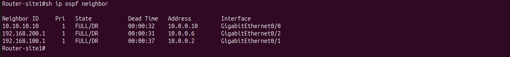  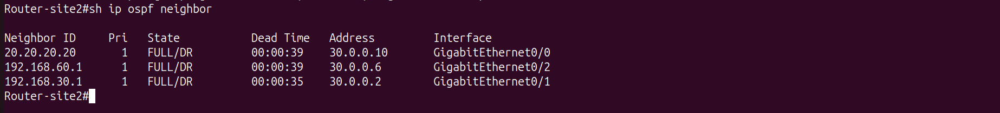  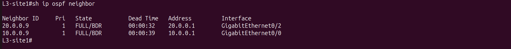  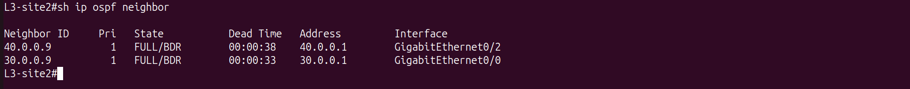
  
- OSPF Routing Table
  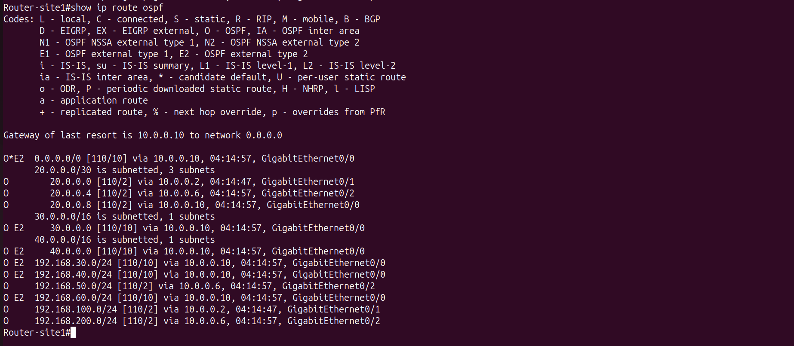  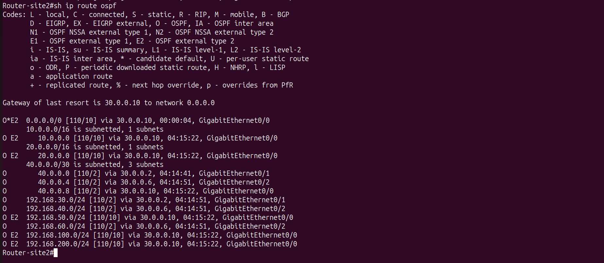  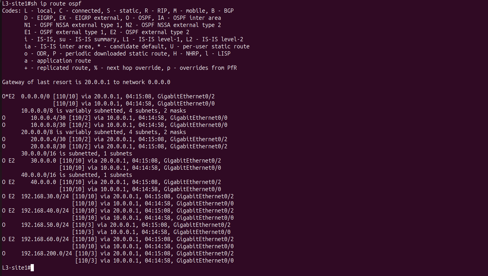  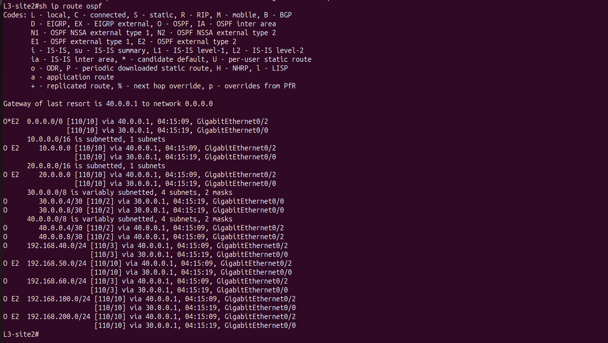
  
- OSPF Interfaces
    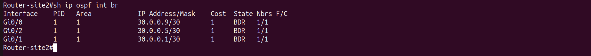
  
- Successful End-to-End Ping
  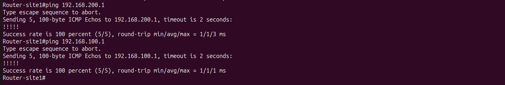  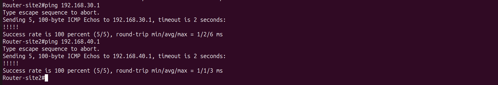  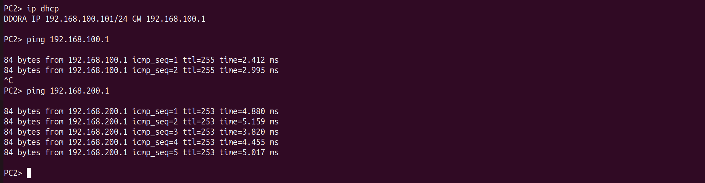  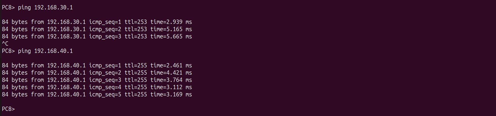

---

# 📖 Notes

This configuration forms the internal routing foundation for the enterprise network.

Once OSPF was operational, the next phase was integrating the FortiGate firewalls and extending connectivity securely across the IPSec VPN.
