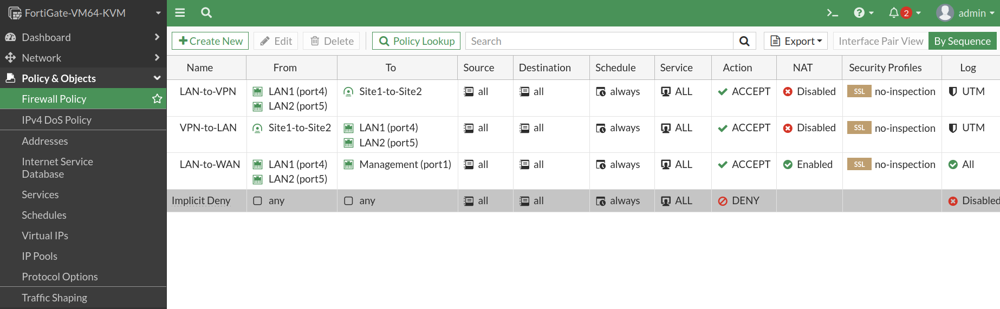
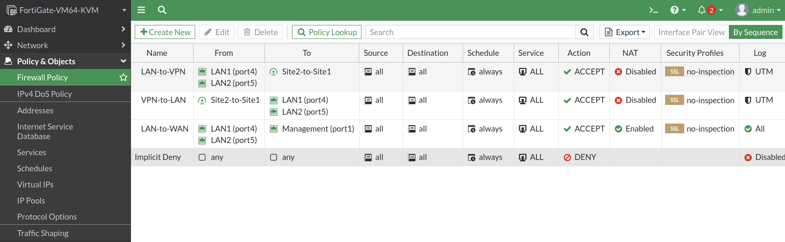
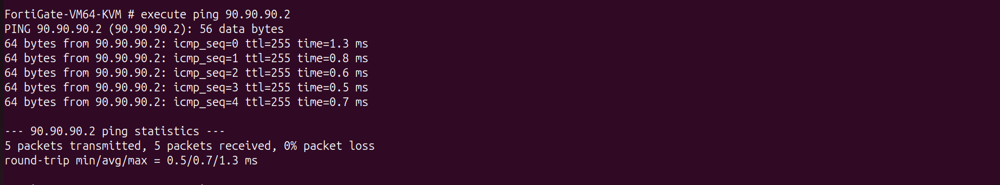

# 🛡️ Firewall Policy Configuration

---

# 📌 Objective

The objective of this phase was to configure FortiGate firewall policies that securely control traffic flowing between the enterprise LANs, the IPSec VPN tunnel, and the Internet.

Firewall policies were implemented following the principle of explicitly allowing only the required traffic between trusted interfaces while maintaining secure segmentation between network zones.

---

# 🌐 Policy Design

Traffic was categorized into three logical directions:

| Source | Destination | Purpose |
|---------|-------------|---------|
| Internal LAN | Internet | Internet Access (NAT) |
| Internal LAN | IPSec VPN | Secure Inter-Site Communication |
| IPSec VPN | Internal LAN | Return Traffic from Remote Site |

---

# 🏗️ Firewall Policy Flow

Singapore Site

```
LAN
   │
   ▼
FortiGate
   │
   ├────────► Internet (NAT)
   │
   └────────► IPSec VPN
                   │
                   ▼
             India FortiGate
                   │
                   ▼
                 Remote LAN
```

---

# ⚙️ Policies Implemented

The following firewall policies were configured on both FortiGate firewalls.

## LAN → VPN

Purpose:

- Allow enterprise users to communicate with the remote site through the IPSec tunnel.

Configuration included:

- Source Interface: LAN
- Destination Interface: IPSec Tunnel
- Source Address: Local Enterprise Networks
- Destination Address: Remote Enterprise Networks
- Service: ALL
- Action: ACCEPT
- NAT: Disabled

---

## VPN → LAN

Purpose:

- Allow return traffic arriving from the remote enterprise site.

Configuration included:

- Source Interface: IPSec Tunnel
- Destination Interface: LAN
- Source Address: Remote Enterprise Networks
- Destination Address: Local Enterprise Networks
- Service: ALL
- Action: ACCEPT
- NAT: Disabled

---

## LAN → Internet

Purpose:

Provide Internet connectivity for enterprise users.

Configuration included:

- Source Interface: LAN
- Destination Interface: WAN
- Source Address: Internal Networks
- Destination Address: ALL
- Service: ALL
- Action: ACCEPT
- NAT: Enabled

---

# 📷 Configuration Screenshots

- Singapore Firewall Policies
  
  
- India Firewall Policies
  

---

# ✅ Verification

Firewall policy verification included:

- Successful inter-site communication
- Successful Internet connectivity
- Successful return traffic through the IPSec tunnel
- No policy drops observed during packet testing

---

# 📷 Verification Screenshots

- Successful Ping Site1 → Site2
  
  
- Successful Ping Site2 → Site1
  
  
- Internet Connectivity
  
  
---

# 📖 Notes

Correct firewall policies were essential for allowing encrypted traffic to traverse the IPSec tunnel.

Traffic matching the VPN selectors was forwarded through the tunnel, while Internet-bound traffic was translated using Source NAT before leaving the WAN interface.
