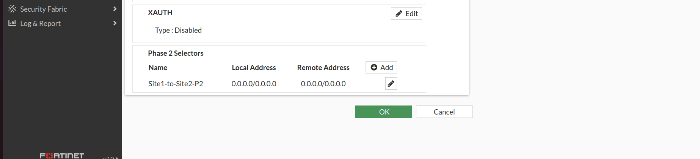
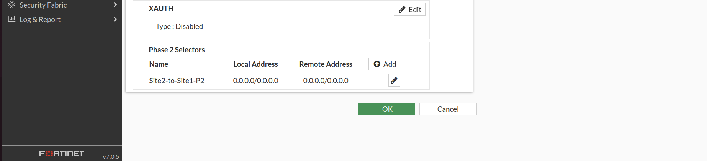

# 🔒 IPSec VPN Phase 2 Configuration

---

# 📌 Objective

The objective of Phase 2 was to establish the IPSec Security Association (IPSec SA) responsible for encrypting and decrypting user data exchanged between the Singapore and India sites.

Unlike Phase 1, which negotiates the secure control channel, Phase 2 is responsible for protecting the actual data traffic transmitted through the VPN tunnel.

The deployment uses a **Route-Based IPSec VPN**, allowing dynamic routing and multiple enterprise networks to communicate securely through a single tunnel interface.

---

# 🌐 Phase 2 Design

| Parameter | Value |
|-----------|-------|
| VPN Type | Route-Based IPSec |
| Encapsulation | ESP |
| Encryption | DES |
| Authentication | SHA1 |
| Perfect Forward Secrecy (PFS) | Disabled |
| Key Lifetime | Default |
| Source Address | 0.0.0.0/0 |
| Destination Address | 0.0.0.0/0 |

> **Note:** The FortiGate VM trial image used in this project supports DES/SHA1 with DH Group 5. Matching Phase 2 proposals were configured on both FortiGate firewalls to ensure successful IPSec Security Association negotiation.

---

# 🌍 Traffic Selectors

The VPN was configured using wildcard traffic selectors:

| Local Network | Remote Network |
|---------------|----------------|
| 0.0.0.0/0 | 0.0.0.0/0 |

Using wildcard selectors allows the tunnel to securely carry traffic for multiple enterprise subnets while routing decisions are handled separately through static routes and OSPF.

---

# ⚙️ Configuration Summary

The following tasks were completed:

- Configured IPSec Proposal
- Configured ESP Encryption
- Configured ESP Authentication
- Disabled Perfect Forward Secrecy (PFS)
- Configured Wildcard Traffic Selectors
- Bound Phase 2 to the Route-Based Tunnel Interface

---

# 📷 Configuration Screenshots

- Singapore FortiGate Phase 2 Configuration
  
  
- India FortiGate Phase 2 Configuration
  
  
---

# ✅ Verification

Phase 2 operation was verified using the following commands:

```text
diagnose vpn tunnel list

diagnose vpn ike gateway list

show vpn ipsec phase2-interface
```

Successful verification confirmed:

- IPSec Security Association established
- ESP Security Associations installed
- Tunnel interface operational
- Bidirectional encrypted communication established

---

# 🔐 Encryption Verification

The following output was monitored during continuous ICMP testing between both sites.

```text
diagnose vpn tunnel list
```

Verification included:

- Increasing encrypted packet counters
- Increasing decrypted packet counters
- Increasing transmitted bytes
- Increasing received bytes
- Active ESP Security Associations

These counters confirmed that enterprise traffic was successfully encrypted before transmission and decrypted upon arrival at the remote site.

---

# 📷 Verification Screenshots

- diagnose vpn tunnel list
- Encryption Counters
- Tunnel Status
- ESP Security Associations
  
  

---

# 📖 Notes

Phase 2 completed the deployment of the IPSec tunnel by establishing the Security Associations responsible for encrypting enterprise traffic.

Once the tunnel became operational, static routes and OSPF redistribution were configured to exchange enterprise routes securely across both sites.
