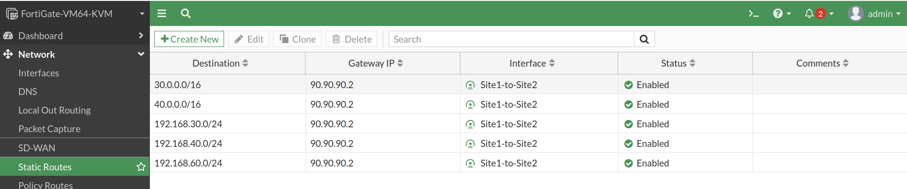
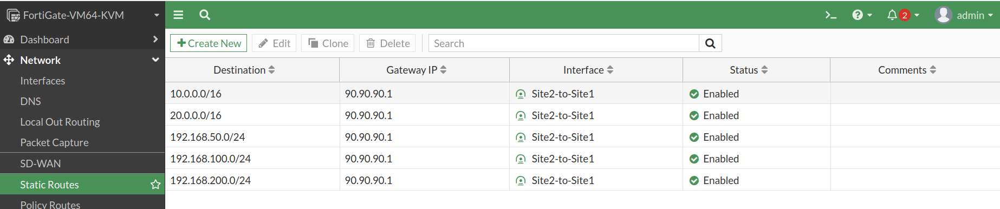

# 🛣️ Static Route Configuration

---

# 📌 Objective

The objective of this phase was to configure static routes on both FortiGate firewalls to direct enterprise traffic destined for remote networks through the Route-Based IPSec VPN tunnel.

Since the VPN was implemented using a route-based design, the FortiGate required explicit routing entries that pointed remote enterprise networks towards the VPN tunnel interface.

These static routes later became the basis for route redistribution into OSPF, allowing internal routers and Layer-3 switches to dynamically learn remote site networks.

---

# 🌐 Routing Design

The FortiGate firewalls maintain static routes for all remote enterprise networks.

Traffic matching these routes is forwarded through the IPSec tunnel instead of the Internet.

---

Singapore Site

```
Local LAN
      │
      ▼
FortiGate
      │
Static Route
      │
      ▼
IPSec Tunnel
      │
      ▼
India FortiGate
      │
      ▼
Remote LAN
```

---

# 🛣️ Singapore FortiGate Static Routes

The following remote networks were configured as static routes through the VPN tunnel.

| Destination Network | Next Hop |
|---------------------|----------|
| 192.168.30.0/24 | IPSec Tunnel |
| 192.168.40.0/24 | IPSec Tunnel |
| 192.168.60.0/24 | IPSec Tunnel |

---

# 🛣️ India FortiGate Static Routes

The following remote networks were configured.

| Destination Network | Next Hop |
|---------------------|----------|
| 192.168.100.0/24 | IPSec Tunnel |
| 192.168.200.0/24 | IPSec Tunnel |
| 192.168.50.0/24 | IPSec Tunnel |

---

# ⚙️ Configuration Summary

The following tasks were completed:

- Created static routes for remote enterprise networks
- Bound each route to the IPSec tunnel interface
- Verified routing table installation
- Verified successful forwarding through the VPN

---

# 📷 Configuration Screenshots

- Singapore Static Routes
  

- India Static Routes
  
---

# ✅ Verification

Static route verification was performed using:

```text
get router info routing-table all

show router static
```

Successful verification confirmed:

- Remote enterprise networks installed in the routing table
- VPN tunnel selected as the outgoing interface
- Correct forwarding of enterprise traffic

---

# 📷 Verification Screenshots

- Routing Table (Singapore)
  
  
- Routing Table (India)
  
---

# 📖 Notes

Unlike a policy-based VPN, a route-based IPSec VPN relies on the routing table to determine how traffic reaches remote networks.

Proper static route configuration ensured that traffic destined for remote enterprise subnets was forwarded into the VPN tunnel, enabling secure communication between both sites.

These static routes were later redistributed into OSPF to provide dynamic route learning across the enterprise network.
