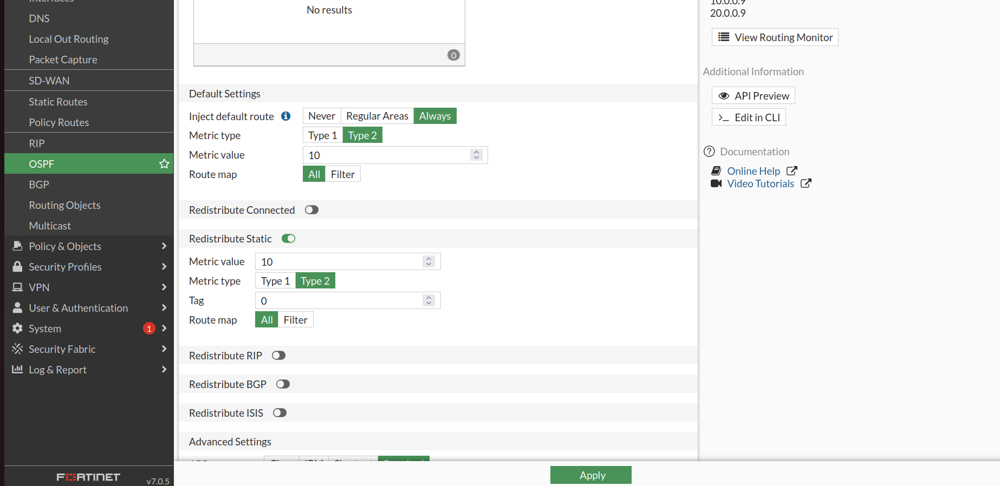
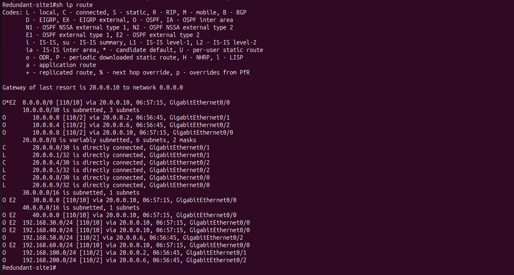
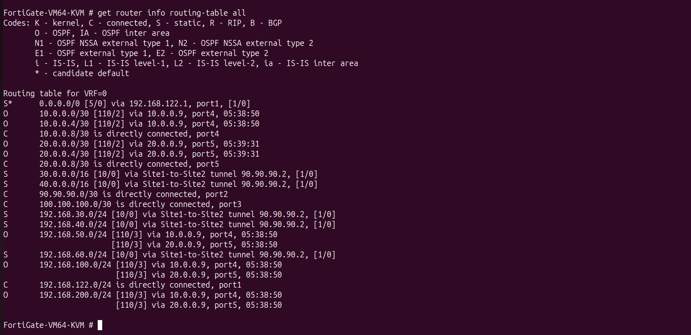
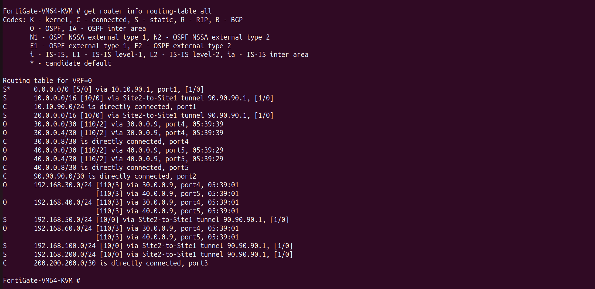

# 🔄 Route Redistribution

---

# 📌 Objective

The objective of this phase was to redistribute static routes configured on the FortiGate firewalls into the OSPF routing domain.

Since the IPSec VPN was implemented as a Route-Based VPN, the FortiGate firewalls used static routes to reach remote enterprise networks. However, these routes were not automatically advertised to the Cisco routers and Layer-3 switches participating in OSPF.

By redistributing static routes into OSPF, all internal routing devices dynamically learned the remote enterprise networks without requiring manual static routes.

---

# 🌐 Network Design

```

```
Singapore LAN
      │
      ▼
Cisco L3 Switches
      │
      ▼
Cisco Router
      │
      ▼
FortiGate
      │
Static Routes
      │
      ▼
Redistribute into OSPF
      │
      ▼
Cisco Routers learn Remote Networks
```

```markdown
---

# ❓ Why Route Redistribution Was Required

The FortiGate firewall forwards traffic through the IPSec tunnel using static routes.

However, the Cisco routers exchange routing information using OSPF.

Without redistribution:

- Remote networks remained unknown to Cisco routers.
- Internal routing tables were incomplete.
- Enterprise users could not communicate across the VPN.

Redistributing static routes into OSPF solved this problem by advertising all remote enterprise networks to the OSPF domain.

---

# ⚙️ Configuration Summary

The following tasks were completed:

- Enabled redistribution of static routes
- Advertised VPN routes into OSPF
- Verified route installation
- Verified dynamic route learning

---

# 📷 Configuration Screenshot

- FortiGate OSPF Redistribution Configuration
  

---

# ✅ Verification

The following commands were used to verify successful redistribution:

```text
get router info routing-table all

show ip route

show ip ospf database
```

Successful verification confirmed:

- Remote enterprise routes learned dynamically
- OSPF database updated
- Remote VLANs reachable
- End-to-end connectivity restored

---

# 📷 Verification Screenshots

- Cisco Router Routing Table
  
  
- Cisco Layer-3 Switch Routing Table
  
  
- FortiGate Routing Table
  
  

---

# 🌍 Learned Remote Networks

## Singapore Site learned

| Network |
|----------|
| 192.168.30.0/24 |
| 192.168.40.0/24 |
| 192.168.60.0/24 |

---

## India Site learned

| Network |
|----------|
| 192.168.100.0/24 |
| 192.168.200.0/24 |
| 192.168.50.0/24 |

---

# 📖 Notes

Route redistribution provided seamless integration between the FortiGate routing table and the Cisco OSPF domain.

This allowed all internal routing devices to automatically learn remote enterprise networks while keeping the IPSec VPN implementation transparent to end users.
