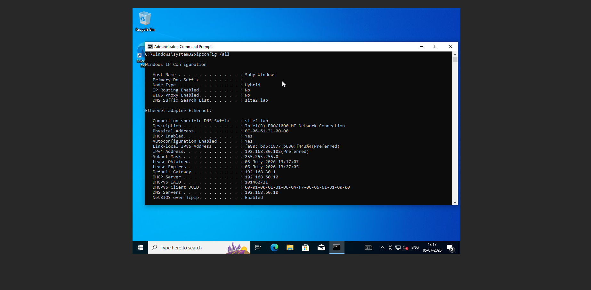
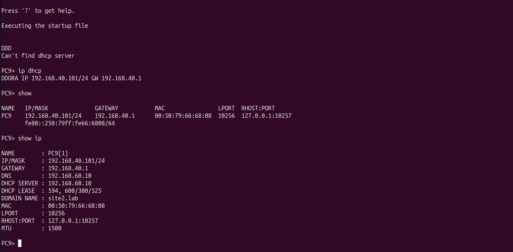

# 🖥️ Ubuntu DHCP Server Configuration

---

# 📌 Objective

The objective of this phase was to deploy centralized DHCP services for both enterprise sites using Ubuntu Linux.

The DHCP servers were responsible for dynamically assigning IP addresses, subnet masks, default gateways, and DNS server information to client devices within their respective VLANs.

Automating IP address allocation reduced administrative overhead while ensuring consistent network configuration across the enterprise.

---

# 🌐 DHCP Architecture

Each enterprise site contains a dedicated Ubuntu DHCP Server.

The DHCP servers provide:

- Dynamic IP Address Assignment
- Default Gateway
- DNS Server Address
- Lease Management

Each DHCP server serves only its local enterprise site.

---

# 🏗️ DHCP Services

## Singapore Site

The DHCP server provides addresses for:

| VLAN | Network | Purpose |
|------|---------|---------|
| VLAN100 | 192.168.100.0/24 | User Network |
| VLAN200 | 192.168.200.0/24 | User Network |

---

## India Site

The DHCP server provides addresses for:

| VLAN | Network | Purpose |
|------|---------|---------|
| VLAN300 | 192.168.30.0/24 | User Network |
| VLAN400 | 192.168.40.0/24 | User Network |

---

# ⚙️ Configuration Summary

The following tasks were completed:

- Installed ISC DHCP Server
- Configured DHCP scopes
- Configured subnet masks
- Configured default gateways
- Configured DNS server addresses
- Configured lease times
- Started and enabled the DHCP service

---

# 📷 Configuration Screenshots

- Singapore DHCP Configuration
  
  
- India DHCP Configuration
  
  
---

# ✅ Verification

DHCP operation was verified using:

Client verification:

```text
ipconfig /all
```

Linux verification:

```text
ip addr

cat /var/lib/dhcp/dhcpd.leases
```

Successful verification confirmed:

- Clients received valid IP addresses
- Default gateway assigned correctly
- DNS server assigned correctly
- Lease allocation successful

---

# 📷 Verification Screenshots

- DHCP Lease File
  
  
  
- Windows Client IP Configuration
  
  
- VPCS IP Configuration
  
  
---

# 📖 Notes

Using DHCP significantly simplified network administration by eliminating manual IP configuration for enterprise clients.

The DHCP servers also provided DNS server information, allowing users to resolve both internal and external domain names automatically.
