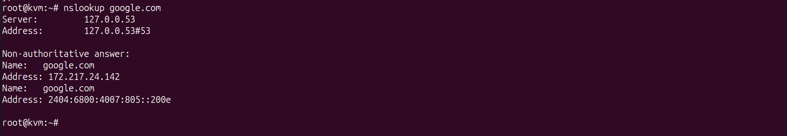
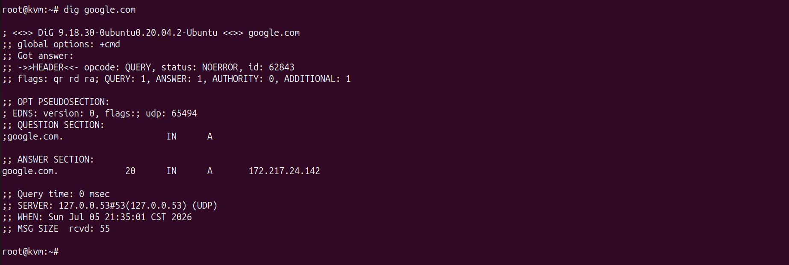

# 🌐 Ubuntu BIND9 DNS Server Configuration

---

# 📌 Objective

The objective of this phase was to deploy BIND9 on Ubuntu Linux to provide centralized Domain Name System (DNS) services for each enterprise site.

The DNS servers were configured to provide:

- Internal hostname resolution
- External Internet name resolution
- Recursive DNS lookups
- DNS forwarding to public DNS servers

Each enterprise site hosts its own dedicated DNS server, allowing local clients to resolve both internal and external Fully Qualified Domain Names (FQDNs).

---

# 🌍 DNS Architecture

Each enterprise site contains:

- Ubuntu Linux Server
- BIND9 DNS Server
- Recursive DNS Resolver
- Public DNS Forwarders

The DNS servers receive queries from local clients and either:

- Resolve internal records locally
- Forward external queries to public DNS servers

---

# 🏗️ DNS Services

The following services were configured:

- Recursive DNS Resolution
- DNS Forwarding
- Public DNS Resolution
- Local Zone Resolution
- Client DNS Services

---

# ⚙️ Configuration Summary

The following tasks were completed:

- Installed BIND9
- Configured named.conf.options
- Configured recursive DNS
- Configured DNS forwarders
- Configured allow-query
- Enabled DNS service
- Verified DNS functionality

---

# 📷 Configuration Screenshots

- named.conf.options (Singapore)
  
  
- named.conf.options (India)
  

---

# 🌐 DNS Forwarders

Public DNS forwarders configured:

| DNS Server | Purpose |
|------------|---------|
| 8.8.8.8 | Google Public DNS |
| 1.1.1.1 | Cloudflare DNS |

These forwarders allow enterprise users to resolve Internet domain names while the local BIND9 server performs recursive queries on behalf of the clients.

---

# ✅ Verification

DNS functionality was verified using:

Ubuntu Server

```text
nslookup google.com

dig google.com
```

Client Verification

```text
ping google.com

nslookup google.com
```

Successful verification confirmed:

- Internal DNS operational
- Recursive DNS functioning
- Internet FQDN resolution successful
- Client DNS configuration correct

---

# 📷 Verification Screenshots

- nslookup google.com (Ubuntu)
  
  
- dig google.com
  
  
- Client ping google.com
  
  
---

# 📖 Notes

The BIND9 servers provide enterprise-wide name resolution services for their respective sites.

# 💡 Key Learning

Using a dedicated BIND9 DNS server allows enterprise clients to resolve both internal and external domain names while centralizing DNS management.

By integrating DHCP and DNS services, client devices automatically receive the correct DNS configuration, simplifying administration and providing a consistent user experience across the enterprise network.

Clients automatically receive the appropriate DNS server through DHCP, allowing seamless access to both internal resources and Internet services without requiring manual DNS configuration.
