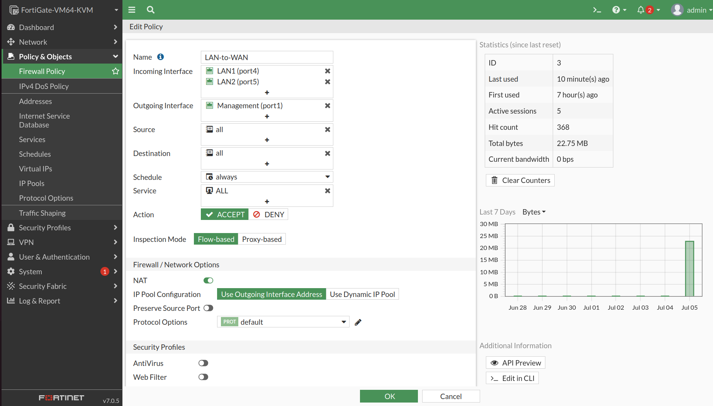

# 🌍 Internet Connectivity & NAT Configuration

---

# 📌 Objective

The objective of this phase was to provide secure Internet connectivity for enterprise users at both the Singapore and India sites through the FortiGate firewalls.

Network Address Translation (NAT) was implemented to allow private IP addresses from internal enterprise networks to communicate with public Internet resources while maintaining secure communication over the IPSec VPN.

This design ensures that:

- Internal users can access Internet services.
- VPN traffic remains encrypted and is not translated.
- Internet-bound traffic is translated using Source NAT (PAT).

---

# 🌐 Internet Architecture

Internet access is provided through the WAN interface of each FortiGate firewall.

The FortiGate performs Source NAT (PAT), translating private enterprise IP addresses into the public IP address of the WAN interface before forwarding traffic to the Internet.

```
Enterprise Client
        │
        ▼
 Layer-3 Switch
        │
        ▼
   FortiGate
        │
        ├────────► IPSec VPN (No NAT)
        │
        ▼
    Source NAT
        │
        ▼
     Internet
```

---

# 🔄 NAT Policy Design

| Traffic Type | NAT |
|--------------|-----|
| LAN → Internet | Enabled |
| LAN → IPSec VPN | Disabled |
| IPSec VPN → LAN | Disabled |

This design ensures that:

- Internet traffic is translated.
- VPN traffic remains encrypted and unmodified.
- Internal routing remains consistent across both sites.

---

# ⚙️ Configuration Summary

The following tasks were completed:

- Configured WAN interface
- Configured default route
- Created LAN → WAN firewall policy
- Enabled Source NAT (PAT)
- Verified Internet connectivity
- Verified coexistence of VPN and Internet traffic

---

# 📷 Configuration Screenshots

- Singapore LAN → WAN Policy
  
  
- India LAN → WAN Policy
  
  
- NAT Enabled Screenshot
  

---

# ✅ Verification

Internet connectivity was verified using:

Client Verification

```text
ping 8.8.8.8

ping google.com
```

FortiGate Verification

```text
execute ping 8.8.8.8

execute ping google.com
```

Successful verification confirmed:

- Internet connectivity established
- Public DNS resolution successful
- Source NAT functioning correctly
- VPN traffic unaffected by Internet NAT

---

# 📷 Verification Screenshots

- Successful ping 8.8.8.8
  
  
- Successful ping google.com
  

---

# 🌍 Internet Services Verified

The following services were successfully validated:

- Internet Reachability
- Public DNS Resolution
- Secure VPN Connectivity
- Simultaneous VPN and Internet Access

---

# 📖 Notes

The FortiGate firewall performs Source NAT only for Internet-bound traffic.

Traffic destined for the remote enterprise site continues to use the IPSec tunnel without translation, ensuring secure communication while allowing users to access Internet resources simultaneously.
