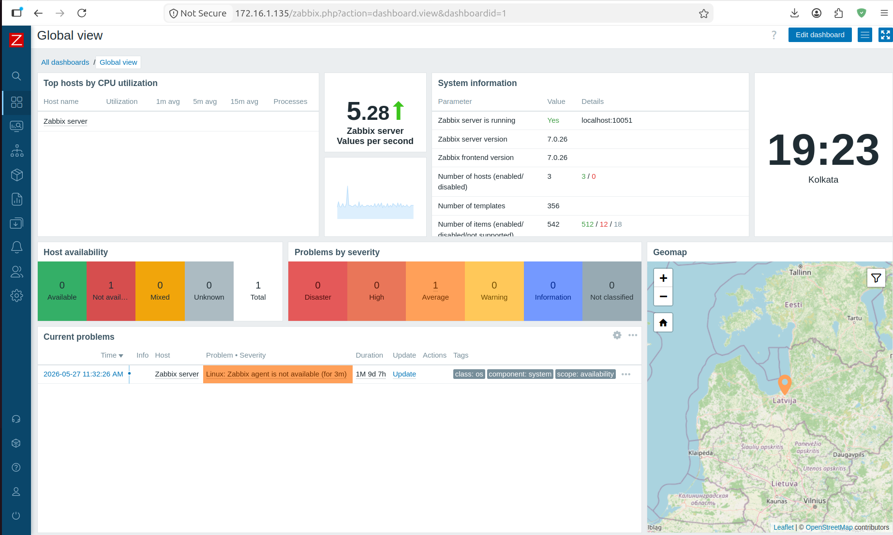
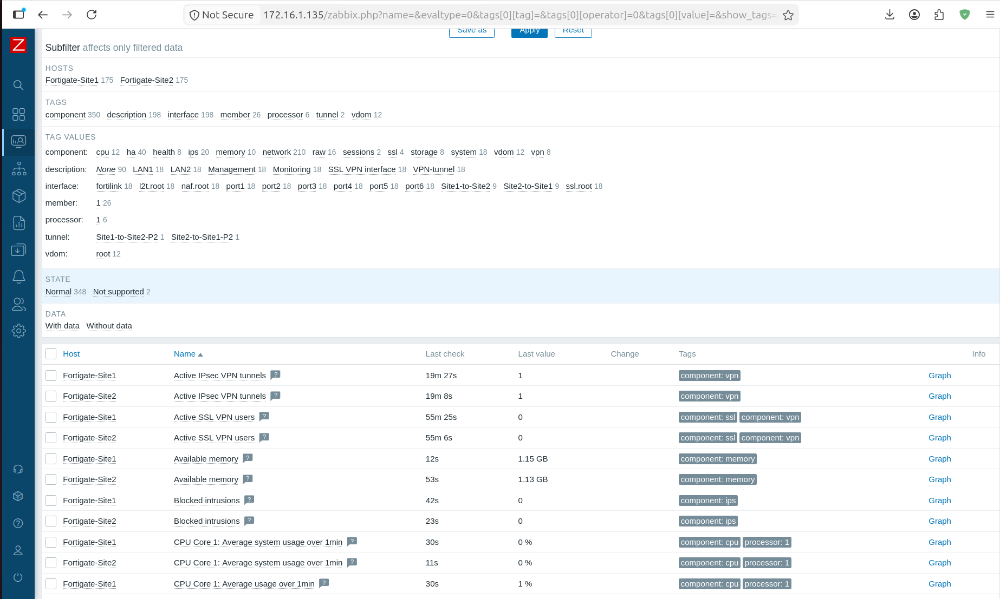

# 📊 Zabbix Dashboard

---

# 📌 Objective

The objective of the Zabbix dashboard is to provide a centralized operational view of the enterprise infrastructure.

The dashboard displays the real-time health of the monitored FortiGate firewalls and the IPSec VPN tunnel.

---

# 🌐 Dashboard Components

The dashboard includes:

- Host Availability
- VPN Tunnel Status
- CPU Usage
- Memory Usage
- Interface Statistics
- SNMP Status

---

# 📷 Dashboard Screenshots

- Zabbix Dashboard
  

- VPN Graph
  

- Host Status
  

- Latest Data
  
  
---

# 📖 Notes

The dashboard provides administrators with a single location to monitor the operational health of the enterprise network and quickly identify potential issues before they impact users.
