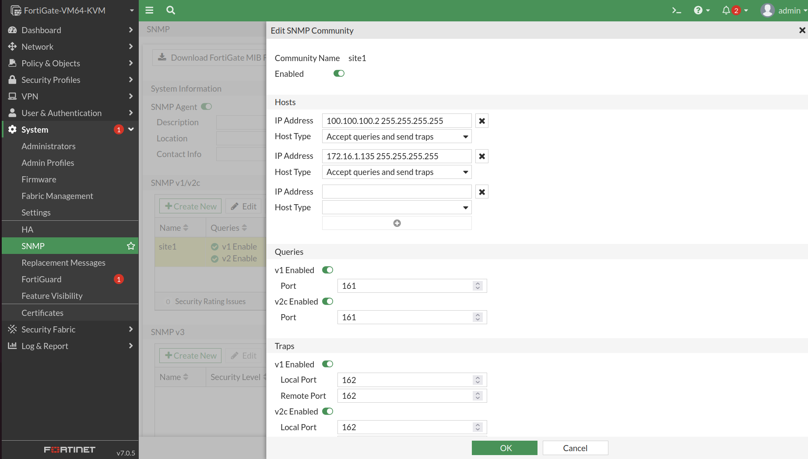
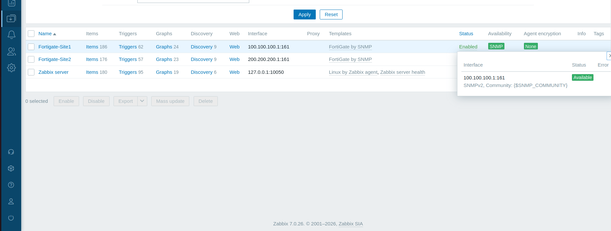

# 📊 FortiGate SNMP Configuration

---

# 📌 Objective

The objective of this phase was to enable Simple Network Management Protocol (SNMP) on both FortiGate firewalls and integrate them with a centralized Zabbix monitoring server.

SNMP provides operational visibility into network devices by allowing Zabbix to periodically collect performance metrics, interface statistics, system information, and VPN status.

This monitoring solution enables proactive health monitoring of the enterprise firewall infrastructure.

---

# 🌐 Monitoring Architecture

The monitoring infrastructure consists of:

- Ubuntu Zabbix Server
- FortiGate Site 1
- FortiGate Site 2
- SNMP Version 2c

The Zabbix Server communicates directly with both FortiGate firewalls using SNMP over the dedicated monitoring network.

---

# ⚙️ Configuration Summary

The following tasks were completed:

- Enabled SNMP on both FortiGate firewalls
- Configured SNMP Community
- Allowed Zabbix Server access
- Configured Management Interface
- Verified SNMP Communication
- Added FortiGate devices into Zabbix

---

# 📷 Configuration Screenshots

- FortiGate Site 1 SNMP Configuration
  
  
- FortiGate Site 2 SNMP Configuration
  

- Zabbix Host Configuration
  

---

# 📈 Metrics Collected

The following information is collected by Zabbix:

- CPU Utilization
- Memory Utilization
- Interface Status
- Interface Traffic
- System Uptime
- VPN Tunnel Status
- SNMP Availability
- Device Health

---

# ✅ Verification

Monitoring was verified by:

- Successful SNMP polling
- Green Availability status
- Automatic metric collection
- Historical data generation

---

# 📷 Verification Screenshots

- Zabbix Hosts Page
  

- FortiGate Latest Data
  

- SNMP Availability
  
  
---

# 📖 Notes

SNMP provides the communication channel between the FortiGate firewalls and the Zabbix monitoring platform.

Successful polling confirms that both firewalls are reachable and continuously monitored by the centralized monitoring system.
