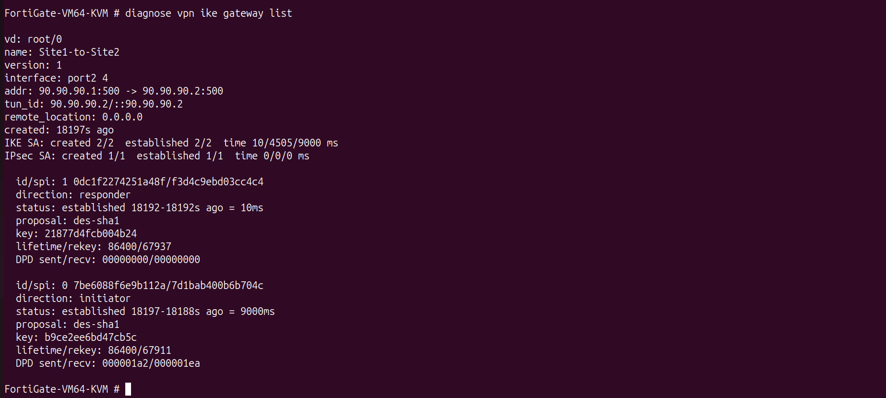
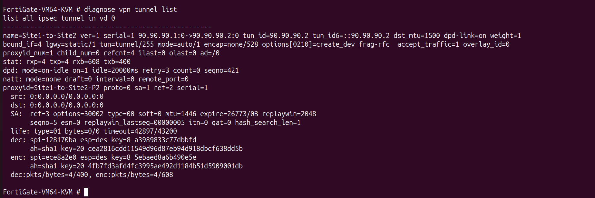
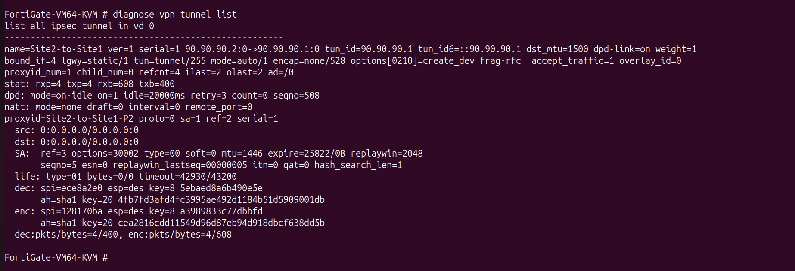
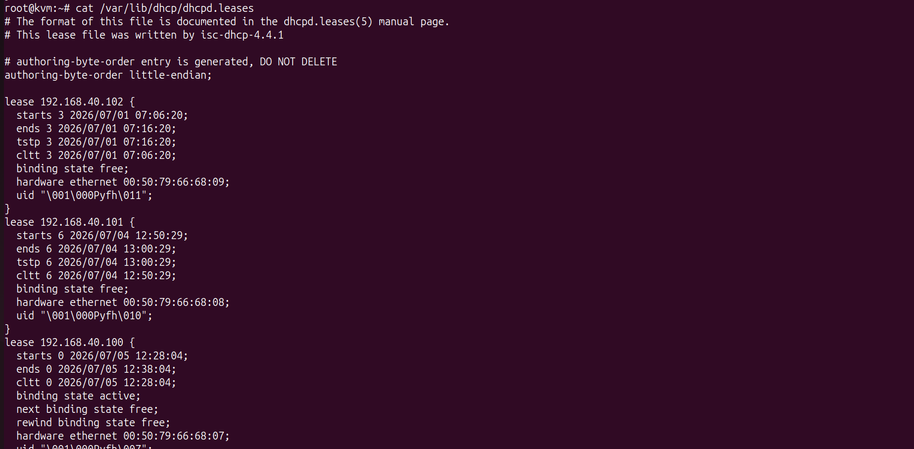
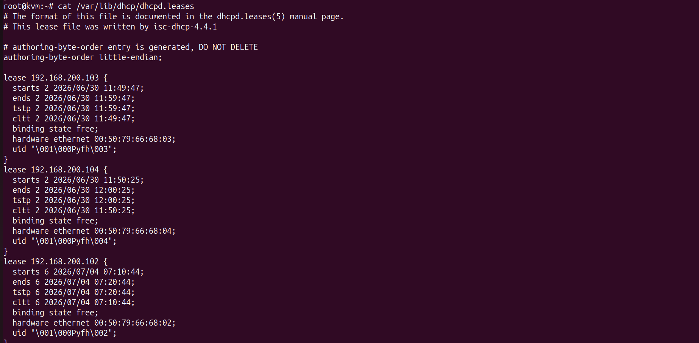
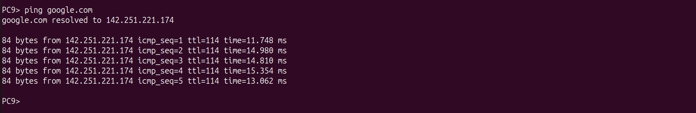
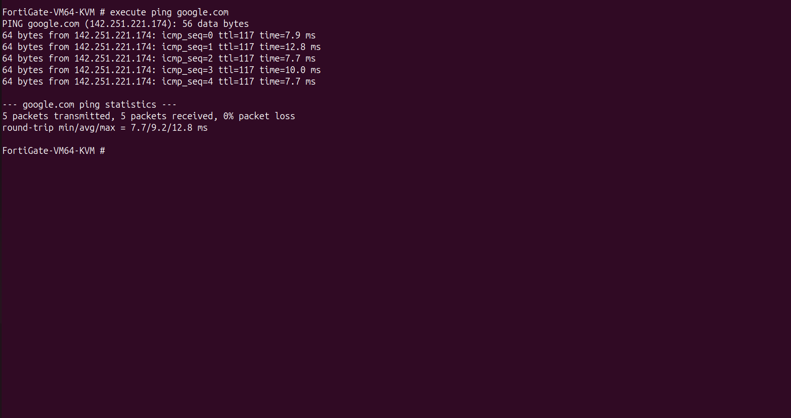
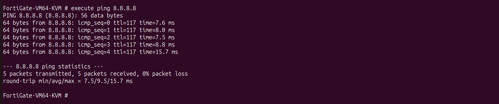
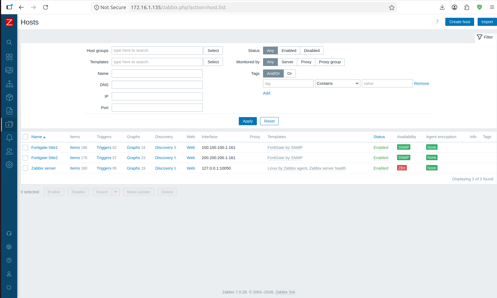
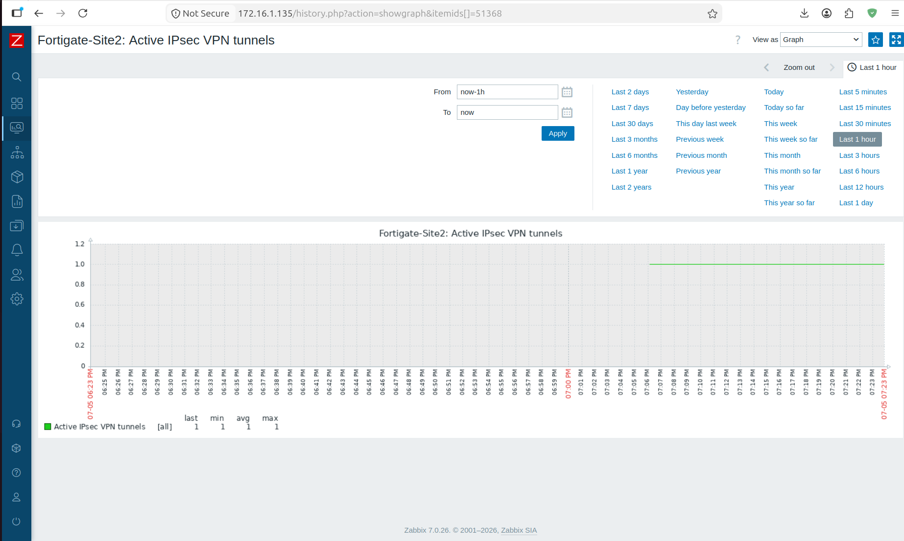

# ✅ End-to-End Verification & Validation

---

# 📌 Objective

The objective of this phase was to verify that all components of the enterprise network were operating correctly after deployment.

Each network service was tested individually before performing complete end-to-end validation across both enterprise sites.

The verification process confirmed the successful integration of routing, switching, security, infrastructure services, Internet connectivity, and centralized monitoring.

---

# 🧪 Verification Summary

| Component | Verification | Status |
|------------|--------------|--------|
| Layer-2 Switching | VLAN Connectivity | ✅ PASS |
| Layer-3 Switching | Inter-VLAN Routing | ✅ PASS |
| OSPF | Neighbor Adjacency | ✅ PASS |
| OSPF | Route Learning | ✅ PASS |
| FortiGate IPSec VPN | Phase 1 | ✅ PASS |
| FortiGate IPSec VPN | Phase 2 | ✅ PASS |
| VPN Tunnel | Encrypted Communication | ✅ PASS |
| Static Routes | Installed | ✅ PASS |
| Route Redistribution | OSPF Learning | ✅ PASS |
| DHCP | IP Address Assignment | ✅ PASS |
| DNS | Internal Name Resolution | ✅ PASS |
| DNS | Public FQDN Resolution | ✅ PASS |
| Internet Access | ICMP Connectivity | ✅ PASS |
| NAT | Source NAT | ✅ PASS |
| Zabbix | SNMP Monitoring | ✅ PASS |
| VPN Monitoring | Tunnel Availability | ✅ PASS |

---

# 🌍 Connectivity Validation

The following connectivity tests were successfully completed.

| Source | Destination | Result |
|---------|-------------|--------|
| PC (Singapore) | PC (India) | ✅ Success |
| PC (Singapore) | DNS Server (India) | ✅ Success |
| PC (India) | DNS Server (Singapore) | ✅ Success |
| PC (Singapore) | google.com | ✅ Success |
| PC (India) | google.com | ✅ Success |
| Zabbix | FortiGate Site 1 | ✅ Success |
| Zabbix | FortiGate Site 2 | ✅ Success |

---

# 🔐 VPN Validation

The IPSec VPN was validated using:

- Tunnel Status
- Phase 1 Security Association
- Phase 2 Security Association
- Encryption Counters
- Decryption Counters

Verification confirmed:

- Tunnel Established
- Active ESP Security Associations
- Increasing Encryption Counters
- Bidirectional Secure Communication

---

# 🌐 Infrastructure Validation

The following infrastructure services were verified.

### DHCP

- Dynamic IP Assignment
- Gateway Assignment
- DNS Assignment

### DNS

- Internal Name Resolution
- Public Name Resolution
- Recursive Queries

### Internet

- Public Connectivity
- Public DNS Resolution

---

# 📊 Monitoring Validation

The monitoring platform successfully verified:

- FortiGate Site 1
- FortiGate Site 2
- SNMP Availability
- VPN Tunnel Monitoring
- Historical Graph Collection

---

# 📷 Verification Screenshots

- OSPF Neighbors
  
  
- VPN Tunnel Status
    
  
- Encryption Counters
    
  
- DHCP Lease
    
  
- Successful google.com Resolution
    
  
- Internet Connectivity
  
  
- Zabbix Hosts
  
  
- VPN Tunnel Graph
  
  
---

# 🎯 Final Validation

The enterprise network successfully met all project objectives.

The completed implementation provides:

- Dynamic Routing
- Secure Site-to-Site Communication
- Enterprise DHCP
- Enterprise DNS
- Internet Access
- Centralized Monitoring
- VPN Monitoring
- End-to-End Connectivity

All deployed services were successfully validated through operational testing and real-world troubleshooting.

