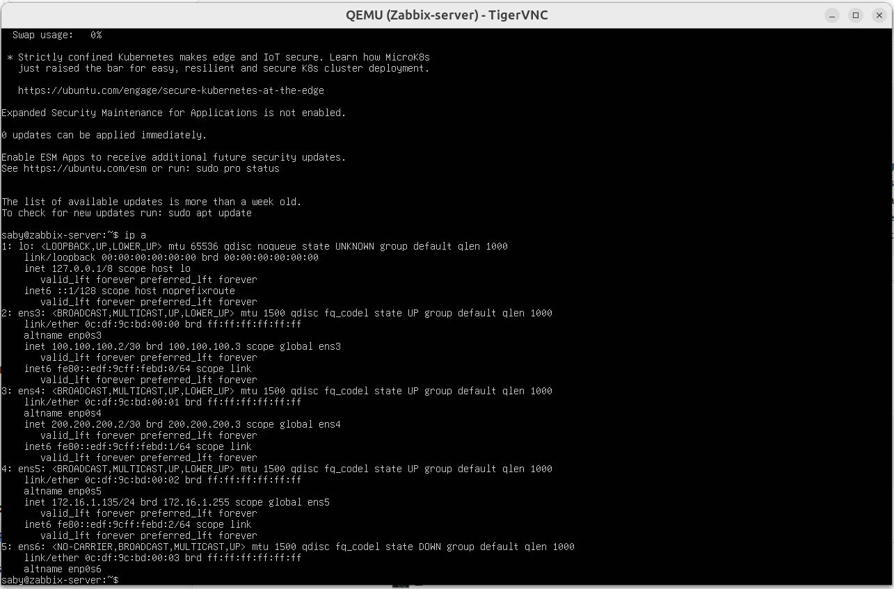
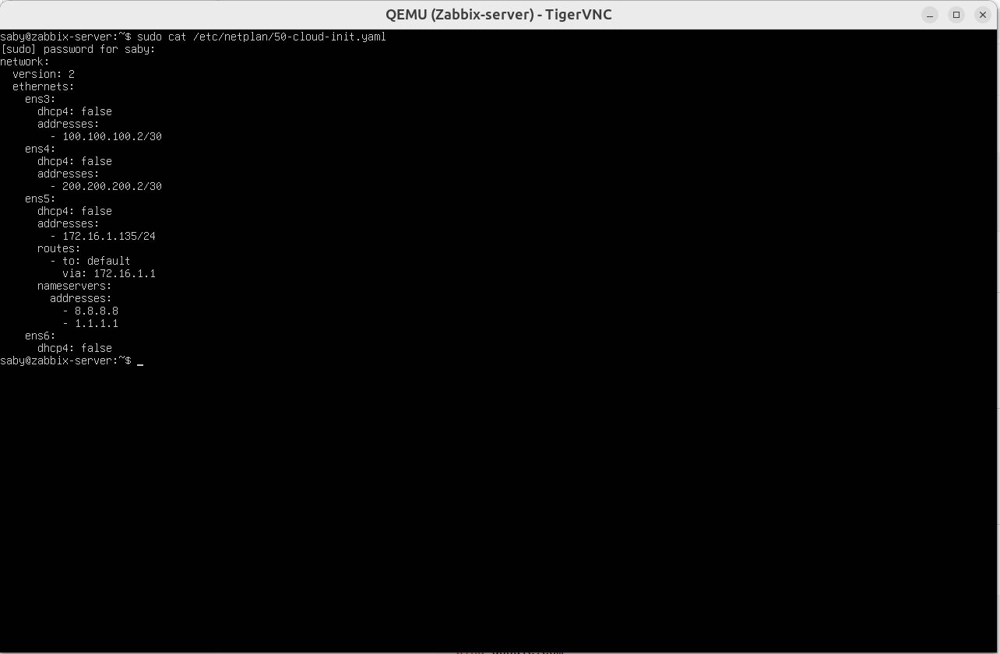
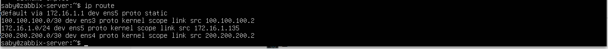
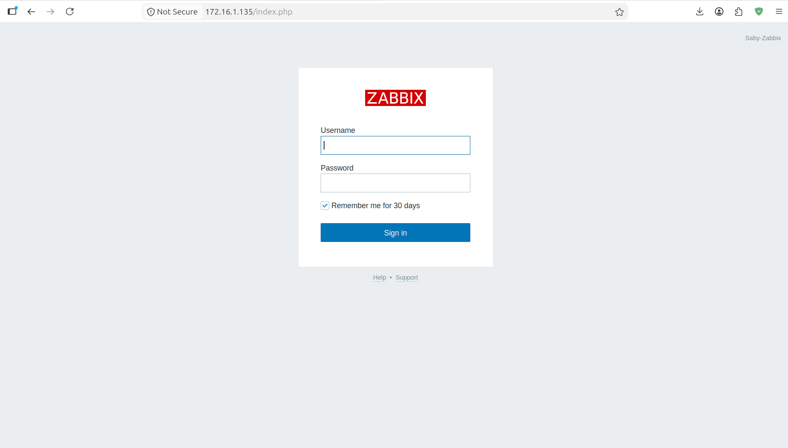

# 🐧 Ubuntu Linux Troubleshooting

---

# 📌 Overview

During the deployment of the enterprise network, several Linux-related issues were encountered while configuring the Ubuntu-based DNS, DHCP, and Zabbix servers.

This section documents the troubleshooting process used to restore network connectivity and ensure proper server operation.

---

# Issue 1 - Ubuntu Server Failed to Obtain an IP Address

## Symptoms

The Ubuntu server failed to obtain an IP address after connecting to the GNS3 NAT Cloud.

As a result:

- Internet connectivity was unavailable.
- The server could not reach external repositories.
- Zabbix installation and updates could not proceed.

---

## Investigation

The following checks were performed:

```text
ip addr

ip link

ip route
```

Network interfaces were inspected to determine which interface was connected to the GNS3 NAT Cloud.

---

# Root Cause

The expected DHCP client utility was unavailable.

Attempting to renew the lease produced:

```text
dhclient: command not found
```

Further investigation showed that the Ubuntu server was connected to the NAT Cloud using a different interface than initially expected.

---

# Resolution

The correct interface connected to the NAT Cloud was identified.

After configuring the appropriate interface and applying the network configuration, the Ubuntu server successfully obtained network connectivity.

---

# Issue 2 - Netplan Configuration

## Symptoms

After assigning a static IP address, Netplan validation failed.

The following message was observed:

```
Conflicting default route declarations for IPv4
```

---

## Investigation

The Netplan configuration was reviewed.

Multiple interfaces contained default gateways, creating conflicting routing information.

---

# Root Cause

More than one network interface was configured with a default route.

Linux requires only one default gateway unless advanced routing policies are configured.

---

# Resolution

The default gateway was retained only on the Internet-facing interface.

The remaining interfaces were configured with IP addresses only.

After applying the updated Netplan configuration:

```text
sudo netplan generate

sudo netplan apply
```

The server routing table was successfully installed.

---

# Issue 3 - Static Management IP

## Objective

The Zabbix server required a permanent management IP address to ensure consistent access to the web interface.

---

## Resolution

A static IP address was configured using Netplan.

Successful verification confirmed:

- Static IP retained after reboot.
- Web interface remained accessible.
- Monitoring continued without interruption.

---

# Verification

The following commands were used throughout troubleshooting:

```text
ip addr

ip route

hostname -I

ping 8.8.8.8

ping google.com

sudo netplan generate

sudo netplan apply
```

Successful verification confirmed:

- Correct IP address assignment.
  
  
  
- Correct routing table.
  
  
- Internet connectivity restored.
  
  
- Stable access to the Zabbix web interface.
  

---

# Lessons Learned

- Always identify the correct Linux network interface before troubleshooting connectivity.
- Only one default gateway should be configured for a standard multi-homed server.
- Netplan validation helps detect routing configuration errors before they are applied.
- Static management addressing simplifies administration of monitoring servers.
- Verifying routing before modifying configuration reduces troubleshooting time.
