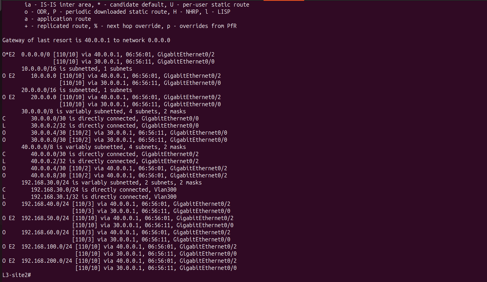

# 🔧 Routing Troubleshooting

---

# 📌 Overview

Dynamic routing played a critical role in establishing end-to-end connectivity between the Singapore and India sites.

Although OSPF neighbor relationships were successfully established within each site, several routing issues prevented communication across the IPSec VPN until the routing design was corrected.

This section documents the routing-related issues encountered during deployment and the steps taken to resolve them.

---

# Issue 1 - Remote Networks Not Present in Routing Table

## Symptoms

- OSPF neighbors successfully established.
- IPSec tunnel operational.
- Remote enterprise networks missing from routing tables.
- End-to-end communication failed.

---

## Investigation

The following commands were used:

```text
show ip route

show ip ospf neighbor

get router info routing-table all
```

Routing tables on both Cisco routers and FortiGate firewalls were compared to identify missing network advertisements.

---

## Root Cause

The FortiGate firewall was forwarding traffic using static routes, but those routes were not being advertised into the OSPF routing domain.

As a result, Cisco routers had no knowledge of the remote enterprise networks.

---

## Resolution

Enabled **Redistribute Static Routes** within the FortiGate OSPF configuration.

Immediately after redistribution, remote networks appeared as external OSPF routes (O E2) in the routing tables.

---

## Verification

Verified using:

```text
show ip route
```

Successful verification showed:

- Remote enterprise networks present.
- O E2 routes installed.
  
  
- End-to-end connectivity restored.
  

---

# Issue 2 - IPSec Tunnel Established but No Connectivity

## Symptoms

- Phase 1 UP.
- Phase 2 UP.
- Tunnel established.
- No successful ping between enterprise sites.

---

## Investigation

The following components were verified:

- Firewall Policies
- Static Routes
- Routing Tables
- OSPF Database
- VPN Tunnel Status

---

## Root Cause

Although the VPN tunnel was established, the Cisco routing infrastructure had not learned the remote enterprise networks.

Traffic never reached the VPN tunnel because routing information was incomplete.

---

## Resolution

Configured static routes on both FortiGate firewalls and redistributed them into OSPF.

This allowed routers and Layer-3 switches to dynamically learn all remote networks.

---

# Issue 3 - Route Verification

After redistribution, the following was confirmed:

- OSPF neighbors remained stable.
- Remote enterprise networks appeared as OSPF External routes.
- End-to-end communication succeeded.
- VPN encryption counters increased during traffic generation.

---

# Verification

The following commands were used throughout troubleshooting:

```text
show ip route

show ip ospf neighbor

show ip ospf database

get router info routing-table all
```

---

# Lessons Learned

- An operational IPSec tunnel alone does not guarantee connectivity.
- Dynamic routing must advertise remote networks before traffic can traverse the VPN.
- Route redistribution is essential when integrating FortiGate static routes into a Cisco OSPF environment.
- Always validate routing tables before investigating higher-layer issues.
