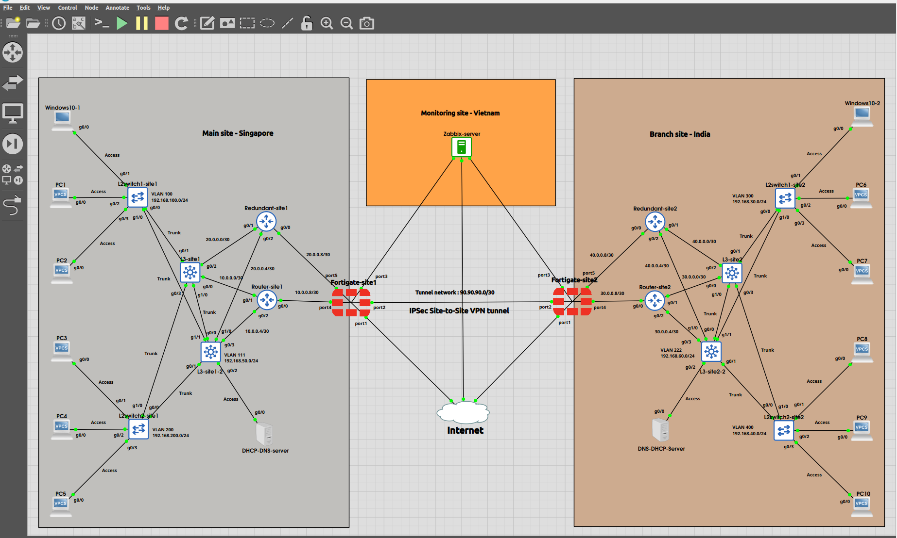

# 🌐 Enterprise Multi-Site Network using FortiGate IPSec VPN, OSPF & Zabbix


---

# 📌 Project Overview

This project demonstrates the design, deployment, monitoring, verification, and troubleshooting of a complete **Enterprise Multi-Site Network** connecting two geographically separated offices using a **FortiGate Route-Based IPSec Site-to-Site VPN**.

The lab was built entirely in **GNS3** using Cisco routers, Layer-2 and Layer-3 switches, FortiGate firewalls, Ubuntu Linux servers, and a centralized Zabbix monitoring server.

The project combines routing, switching, security, Linux infrastructure services, Internet connectivity, and network monitoring into a single integrated enterprise environment.

Unlike traditional networking labs that focus only on configuration, this repository also documents the complete troubleshooting journey, including routing issues, VPN deployment, DNS troubleshooting, Linux networking, and monitoring implementation.

---

# 🖼️ Enterprise Network Topology

<p align="center">
    
</p>

---

# 🚀 Project Features

- 🌍 Enterprise Multi-Site Network
- 🔀 Layer-2 & Layer-3 Switching
- 🌐 VLAN Segmentation & Inter-VLAN Routing
- 🔄 OSPF Dynamic Routing
- 🔒 FortiGate Route-Based IPSec VPN
- 🛡️ Firewall Policies
- 🛣️ Static Route Redistribution into OSPF
- 🖥️ Ubuntu DHCP Server
- 🌐 Ubuntu BIND9 DNS Server
- 🌍 Internet Connectivity with NAT
- 📊 Zabbix Infrastructure Monitoring
- 📡 SNMP Monitoring
- 📈 VPN Tunnel Monitoring
- ✅ End-to-End Network Verification
- 🔧 Real-World Troubleshooting Documentation

---

# 🛠️ Technologies Used

| Category | Technology |
|----------|------------|
| Firewall | FortiGate |
| Routing | Cisco IOS |
| Switching | Cisco Layer-2 & Layer-3 Switches |
| Routing Protocol | OSPF |
| VPN | Route-Based IPSec VPN |
| Operating System | Ubuntu Linux |
| DHCP | ISC DHCP Server |
| DNS | BIND9 |
| Monitoring | Zabbix |
| Network Management | SNMP |
| Virtual Lab | GNS3 |

---

# 📂 Repository Structure

```text
Enterprise-MultiSite-FortiGate-IPSec-VPN/

├── README.md
├── 01-Project-Overview
├── 02-Network-Topology
├── 03-OSPF-Configuration
├── 04-FortiGate-IPSec-VPN
├── 05-Route-Redistribution
├── 06-DHCP-Server
├── 07-DNS-Server
├── 08-Internet-Access
├── 09-Zabbix-Monitoring
├── 10-Verification
├── 11-Troubleshooting
└── Images
```

---

# 📖 Documentation

| Section | Description |
|----------|-------------|
| 📌 Project Overview | Enterprise design and objectives |
| 🏗️ Network Topology | Architecture and IP addressing |
| 🔄 OSPF Configuration | Dynamic routing deployment |
| 🔒 FortiGate IPSec VPN | Phase 1, Phase 2, Firewall Policies, Static Routes |
| 🔁 Route Redistribution | Static routes redistributed into OSPF |
| 🖥️ DHCP Server | Ubuntu ISC DHCP configuration |
| 🌐 DNS Server | Ubuntu BIND9 configuration |
| 🌍 Internet Access | NAT and Internet connectivity |
| 📊 Zabbix Monitoring | SNMP and VPN monitoring |
| ✅ Verification | End-to-end validation |
| 🔧 Troubleshooting | VPN, Routing, DNS, Linux & Zabbix |

---

# 🎯 Skills Demonstrated

This project demonstrates practical experience with:

- Enterprise Network Design
- Layer-2 Switching
- Layer-3 Switching
- VLAN Design
- Inter-VLAN Routing
- OSPF
- Route Redistribution
- FortiGate Firewall Administration
- Route-Based IPSec VPN
- Firewall Policies
- NAT
- Ubuntu Linux Administration
- DHCP
- BIND9 DNS
- SNMP
- Zabbix Monitoring
- Network Troubleshooting
- Technical Documentation

---

# 📊 Project Validation

The completed environment successfully demonstrates:

| Component | Status |
|-----------|--------|
| OSPF Routing | ✅ |
| Inter-VLAN Routing | ✅ |
| IPSec VPN | ✅ |
| Static Routes | ✅ |
| Route Redistribution | ✅ |
| DHCP | ✅ |
| DNS | ✅ |
| Internet Connectivity | ✅ |
| NAT | ✅ |
| SNMP Monitoring | ✅ |
| VPN Monitoring | ✅ |
| End-to-End Connectivity | ✅ |

---

# 💡 Key Learning

This project reinforced the importance of integrating routing, security, Linux infrastructure services, and monitoring within a single enterprise environment.

Beyond deployment, the project emphasized systematic troubleshooting, demonstrating how routing, VPN, DNS, Linux services, and monitoring interact to deliver reliable end-to-end connectivity.

---

# 👨‍💻 Author

**Sabyasachi Dasgupta**

Networking | Network Security | FortiGate | Cisco | Linux | Zabbix | Automation Enthusiast

---

⭐ If you found this project useful, feel free to explore the documentation and provide feedback.
