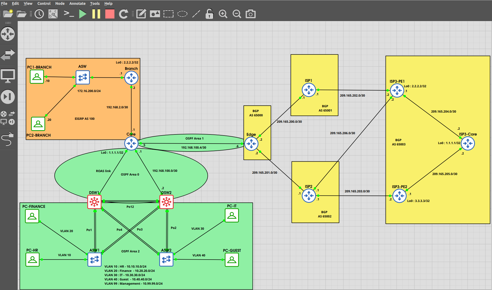

## Overview

### Project Scope

* Platform: GNS3
* Domain: Enterprise multi-protocol routing
* Focus: OSPF, EIGRP, BGP (multi-AS)

---

### Autonomous Systems

* AS 65000 → Enterprise (HQ + Branch)
* AS 65001 → ISP1
* AS 65002 → ISP2
* AS 65003 → Transit backbone (iBGP)

---

### Topology Summary

* HQ ↔ Core ↔ Edge ↔ ISP1 / ISP2
* ISP1 / ISP2 ↔ ISP3 (Transit)
* ISP3 uses iBGP (loopback-based peering)

---

### Protocol Deployment

* OSPF → Core (intra-enterprise routing)
* EIGRP → Branch network
* Redistribution → Core (OSPF ↔ EIGRP)
* eBGP → Edge ↔ ISP1 / ISP2
* iBGP → ISP3 (Core ↔ PE routers)

---

### Key Implementations

* Multi-area OSPF design
* EIGRP branch integration
* Bidirectional route redistribution
* Dual-homed BGP edge
* Loopback-based iBGP sessions
* Static routing for loopback reachability
* Default route propagation from ISP
* BGP network-based route advertisement
* Prefix-list based route filtering

---

### Operational Focus

* BGP session states (Idle / Active / Established)
* Next-hop resolution and reachability
* BGP table vs Routing table behavior
* Route propagation across AS boundaries
* End-to-end forwarding validation

---

### Validation Scope

* Full connectivity:

  * HQ ↔ Branch
  * Enterprise ↔ ISP networks
* Verified using:

  * ping
  * traceroute
  * show ip route
  * show ip bgp

---

### Notes

* BGP advertises only configured networks
* Routes install in RIB only if next-hop is reachable
* Loopback iBGP requires bidirectional reachability
* Missing default route results in traffic drop at ISP

