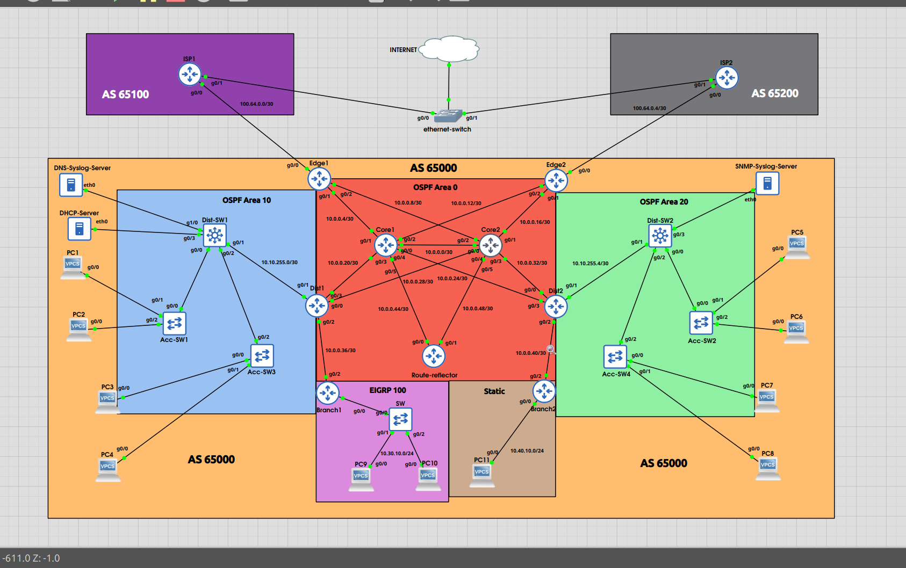

# 🌐 Enterprise Multi-Protocol Routing & Troubleshooting Lab

## 📖 Project Overview

This project simulates a real-world enterprise network environment consisting of:

- Dual ISP connectivity
- Multi-area OSPF design
- EIGRP branch integration
- Static route redistribution
- eBGP and iBGP implementation
- Route Reflector architecture
- NAT overload for internet access
- DHCP, DNS, SNMP, and Syslog services
- Internet failover testing
- Route filtering and packet-flow analysis

The primary goal of this lab was not just protocol configuration, but understanding how routing protocols interact during instability, redistribution, failover, asymmetric routing, and recursive routing conditions.

---

# 🖼️ Topology Diagram



---

# 🏢 Enterprise Network Design

## Core Infrastructure

- Core1
- Core2
- Redundant Layer-3 core connectivity
- OSPF Area 0 backbone

---

## Distribution Layer

### Dist1
- OSPF Area 10 connectivity
- EIGRP redistribution point
- Route exchange between branch and core

### Dist2
- OSPF Area 20 connectivity
- Static route redistribution point
- Route propagation toward enterprise edge

---

## Access Layer

### Area 10 Access Network
- HR VLAN
- IT VLAN
- Server VLAN

### Area 20 Access Network
- User VLANs
- End-device connectivity
- DHCP-based addressing

---

## Branch Networks

### Branch1
- EIGRP-based branch routing
- Redistribution into OSPF

### Branch2
- Static routing branch
- Static-to-OSPF redistribution

---

## Internet Edge

### Edge1
- ISP1 connectivity
- eBGP peering
- NAT overload
- Internet failover

### Edge2
- ISP2 connectivity
- eBGP peering
- Route advertisement
- Redundant internet path

---

## Route Reflector

- Internal iBGP route reflector
- Eliminated full-mesh iBGP requirement
- Centralized route propagation

---

# ⚙️ Technologies Used

- OSPF Multi-Area Routing
- EIGRP
- Static Routing
- eBGP
- iBGP
- Route Reflector
- NAT (PAT)
- Prefix Lists
- Route Maps
- DHCP
- DNS
- SNMP
- Syslog
- Packet Capture Analysis
- Internet Failover

---

# 🎯 Project Objectives

- Build a scalable enterprise routing environment
- Implement dual ISP internet connectivity
- Configure iBGP using route reflection
- Practice route redistribution between protocols
- Implement internet redundancy and failover
- Analyze packet flow using Wireshark
- Troubleshoot recursive routing and asymmetric routing issues
- Implement BGP route filtering

---

# 🔍 Major Troubleshooting Scenarios

---

## 1️⃣ Recursive Default Route Problem

### Issue
Edge routers started learning default routes through OSPF instead of directly from BGP.

### Symptoms
- Default route appeared as:
  ```bash
  O*E2 0.0.0.0/0
  ```

  instead of:

  ```bash
  B* 0.0.0.0/0
  ```

- Internet connectivity became unstable
- Edge routers lost internet access

### Root Cause
Mutual redistribution between OSPF and BGP created recursive routing dependencies.

### Resolution
- Rebuilt BGP configuration
- Removed unstable redistribution logic
- Corrected default route propagation
- Stabilized next-hop behavior

---

## 2️⃣ Local Preference Caused Internet Failure

### Issue
After increasing local preference toward ISP1, Edge2 lost internet connectivity.

### Symptoms
- Edge2 preferred OSPF external routes
- Traffic blackholing occurred
- Failover became unstable

### Root Cause
Improper route propagation and recursive routing behavior.

### Resolution
- Corrected BGP path selection
- Revalidated route advertisement
- Stabilized control-plane behavior

---

## 3️⃣ Internal Devices Worked but Edge Routers Failed

### Issue
Internal LAN devices successfully reached the internet while edge routers themselves failed to ping external destinations.

### Root Cause
NAT behavior differed between:
- transit traffic
- router-generated traffic

### Resolution
- Corrected NAT ACL configuration
- Verified return-path routing
- Revalidated ISP route advertisements

---

## 4️⃣ EIGRP & Static Branch Advertisement Issues

### Issue
Branch routes were inconsistently propagated into BGP.

### Symptoms
- Some routes appeared in ISP routing tables
- Other routes were missing

### Root Cause
OSPF external routes behaved differently during BGP redistribution.

### Resolution
- Applied enterprise route summarization
- Implemented outbound BGP filtering
- Corrected redistribution dependencies

---

## 5️⃣ Internet Failover Failure

### Issue
Shutting down ISP1 caused complete internet failure.

### Root Cause
Edge1 continued injecting default routes into OSPF despite losing upstream ISP connectivity.

### Resolution
- Corrected default-information originate behavior
- Implemented proper failover logic
- Validated convergence behavior

---

# 📡 Packet Flow Analysis

## Normal Internet Flow

```text
PC → Access Switch → Distribution → Core → Edge Router → ISP → Internet
```

---

## Return Traffic Flow

```text
Internet → ISP → Edge Router → Core → Distribution → Access → End Device
```

---

## EIGRP Branch Packet Flow

```text
Branch1 → EIGRP → OSPF Redistribution → BGP → ISP
```

---

## Static Branch Packet Flow

```text
Branch2 → Static Route → OSPF Redistribution → BGP → ISP
```

---

# 🧪 Wireshark Packet Analysis

Wireshark packet captures were heavily used during troubleshooting to analyze:

- ICMP packet flow
- NAT translations
- Return-path failures
- Asymmetric routing behavior
- Missing route advertisements
- Internet failover behavior

Packet analysis significantly improved understanding of:
- routing-table behavior
- forwarding decisions
- protocol interaction
- control-plane instability

---

# 🔐 Route Filtering Implementation

## Implemented Using

- Prefix Lists
- Route Maps

## Purpose

- Prevent transit route advertisement
- Avoid leaking infrastructure routes
- Advertise only enterprise LAN prefixes toward ISPs

---

# 📚 Key Learning Outcomes

- Deep understanding of BGP path selection
- Real-world redistribution troubleshooting
- Recursive routing analysis
- OSPF external route behavior
- NAT troubleshooting
- Internet failover design
- Route reflector behavior
- Packet-flow analysis using Wireshark
- Multi-protocol enterprise troubleshooting

---

# ✅ Final Outcome

The final topology successfully achieved:

- Dual ISP internet connectivity
- Stable OSPF core routing
- EIGRP branch integration
- Static route redistribution
- Internet failover functionality
- Route filtering
- NAT overload
- Stable end-to-end packet forwarding
- Successful packet-flow validation

---

# 🧠 Conclusion

This project evolved far beyond a standard routing lab and became a deep exploration of enterprise troubleshooting and control-plane analysis.

The most valuable outcome was not simply configuring routing protocols, but understanding how routing protocols interact under instability, redistribution, failover, asymmetric routing, and recursive routing scenarios.

The troubleshooting process provided significantly deeper understanding of enterprise networking behavior than configuration alone.
