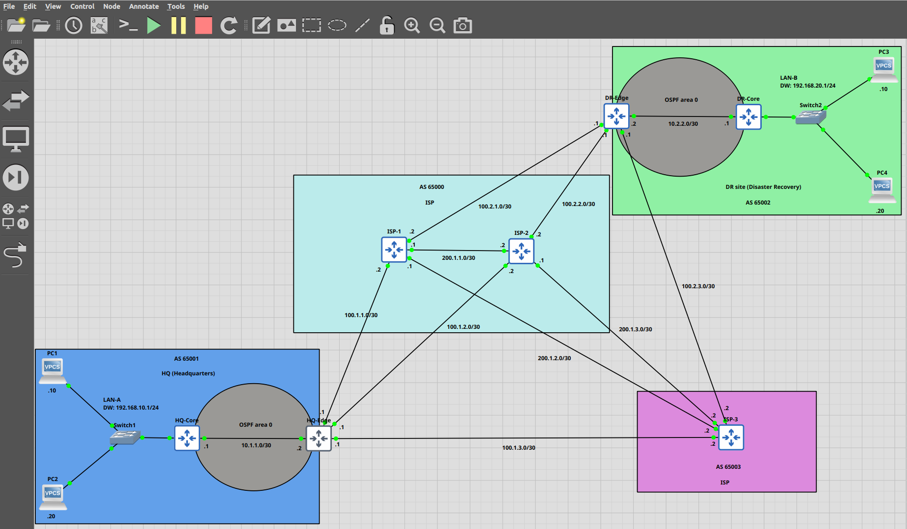

# 🌐 Enterprise Multi-Homed Network using OSPF & BGP (GNS3 Lab)

## 📌 Overview

This project demonstrates the design and implementation of a multi-site enterprise network connected to multiple ISPs using dynamic routing protocols.

The topology includes:

* Two enterprise sites: **HQ (AS 65001)** and **DR (AS 65002)**
* Three ISPs for redundancy and path control
* OSPF used as the Interior Gateway Protocol (IGP)
* BGP used as the Exterior Gateway Protocol (EGP)

---

## 🏗️ Network Topology

* Dual-site enterprise architecture (HQ & DR)
* Triple ISP connectivity (ISP-1, ISP-2, ISP-3)
* Edge routers running eBGP
* Core routers running OSPF

---

## 🌐 IP Addressing Plan

| Segment              | Network         |
| -------------------- | --------------- |
| HQ LAN               | 192.168.10.0/24 |
| DR LAN               | 192.168.20.0/24 |
| HQ-Core ↔ HQ-Edge    | 10.1.1.0/30     |
| DR-Core ↔ DR-Edge    | 10.2.2.0/30     |
| HQ ↔ ISP Links       | 100.1.x.x/30    |
| DR ↔ ISP Links       | 100.2.x.x/30    |
| ISP Interconnections | 200.1.x.x/30    |

---

## 🔁 Routing Design

### 🔹 OSPF (IGP)

* Implemented within each site
* Area 0 used for simplicity
* Advertises LAN and core-edge links
* Passive interfaces enabled for LAN

### 🔹 BGP (EGP)

* eBGP between Enterprise and ISPs
* Separate AS numbers for each domain
* Route exchange between HQ and DR via ISP cloud

---

## 🔄 Redistribution

* BGP routes redistributed into OSPF at edge routers
* Ensures internal routers can reach remote LAN networks
* Verified using OSPF external routes (O E2)

---

## 🎯 Traffic Engineering

### 🔹 Local Preference (Outbound Control)

* HQ prefers ISP-1
* DR prefers ISP-2
* Implemented using route-maps

### 🔹 AS Path Prepending (Inbound Control)

* De-prioritized specific ISP paths
* Controlled how remote networks reach each site

---

## 🌐 Multi-Homing Design

* Enterprise connected to three ISPs
* Provides:

  * Redundancy
  * Load balancing
  * Failover capability

---

## 🚫 Route Filtering

### Outbound Filtering:

* Only LAN prefixes advertised to ISPs
* Prevented internal/transit networks from leaking

### Inbound Filtering:

* Accepted only required remote LAN routes
* Implemented using prefix-lists and route-maps

---

## 🔄 Default Route Injection

* Default route injected into OSPF from edge routers
* Reduced routing table complexity inside the network

---

## 🧪 Verification & Testing

* Verified BGP neighbor relationships (`show ip bgp summary`)
* Checked best path selection (`show ip bgp`)
* Validated routing table (`show ip route`)
* End-to-end connectivity tested using ICMP
* Failover tested by shutting ISP links

---

## 📈 Key Learnings

* Interaction between IGP (OSPF) and EGP (BGP)
* Importance of route redistribution
* BGP path selection attributes
* Multi-homing and redundancy design
* Route filtering for network stability and security
* Real-world troubleshooting methodology

---

## 🛠️ Tools Used

* GNS3
* Cisco IOS images
* Wireshark (optional for packet capture)

---

## 🚀 Conclusion

This project simulates a real-world enterprise network with multi-homing, redundancy, and traffic engineering using industry-standard routing protocols.

---

## 📎 Future Enhancements

* BGP Communities
* Route Summarization
* MPLS Simulation
* VPN Integration (IPsec/GRE)

