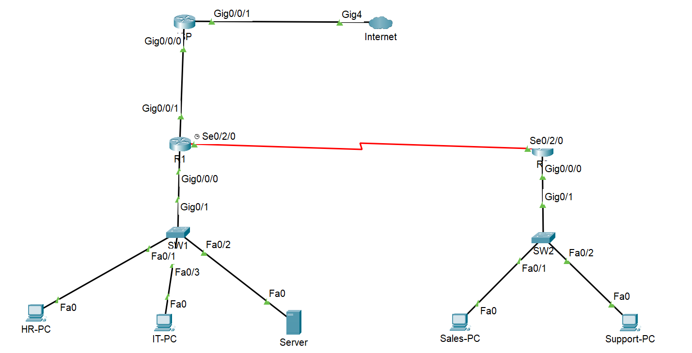

# Enterprise Multi-Site Network Lab

## Overview

Designed and implemented a multi-site enterprise network with VLAN segmentation, OSPF routing, DHCP, NAT, and ACLs, simulating real-world HQ and branch connectivity.

The network includes VLAN segmentation, inter-VLAN routing, dynamic routing using OSPF, DHCP for IP allocation, NAT for internet access, and ACL-based security.

---

## 🏢 Network Design

### HQ Network:

* VLAN 10 → HR
* VLAN 20 → IT
* VLAN 30 → Server

### Branch Network:

* Sales and Support PCs connected via a switch

### WAN:

* Point-to-point link between HQ (R1) and Branch (R2)

---

## ⚙️ Technologies Used

* VLANs
* Inter-VLAN Routing (Router-on-a-Stick)
* OSPF (Dynamic Routing)
* DHCP
* NAT (PAT)
* ACL (Access Control Lists)
* WAN (Serial Link)

---

## 🧠 Key Learning Outcomes

* Designed a multi-site enterprise network
* Implemented VLAN segmentation and routing
* Configured NAT for internet access
* Troubleshot NAT issues for branch connectivity
* Understood real-world traffic flow and packet behavior

---

## 🖼️ Topology

---

## 📂 Project Files

* configuration.md → Full device configurations
* troubleshooting.md → Issues faced and resolutions
* verification.md → Testing and validation steps

