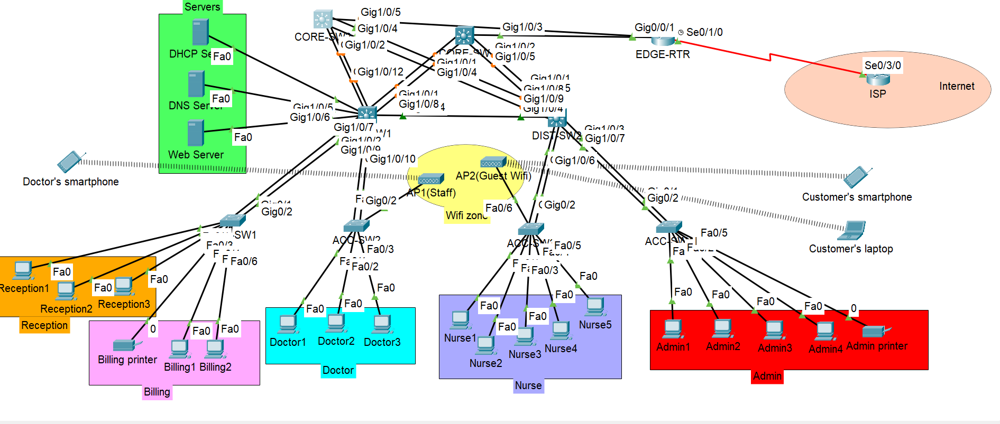

# 🏥 Enterprise Hospital Network Design (Cisco Packet Tracer)



## 📌 Project Overview

This project demonstrates the design and implementation of a **highly available enterprise hospital network** using Cisco Packet Tracer.

It covers core networking concepts including:

* VLAN Segmentation
* Inter-VLAN Routing
* OSPF Dynamic Routing
* EtherChannel (L2 & L3)
* ECMP Load Balancing
* Wireless Networking
* WAN Connectivity (Serial Link)
* Port Security

---

## 🖼️ Network Topology Explanation

- Core Layer provides backbone connectivity  
- Distribution Layer handles routing and policy  
- Access Layer connects end devices  
- Wireless zone supports mobile connectivity  
- Edge Router connects internal network to ISP

---

## 🚀 Project Highlights

- 3-Tier Enterprise Network Architecture  
- VLAN Segmentation (7 VLANs)  
- Inter-VLAN Routing using SVIs  
- OSPF Dynamic Routing  
- ECMP Load Balancing  
- Layer 2 & Layer 3 EtherChannel  
- Wireless Network (Staff & Guest WiFi)  
- WAN Connectivity using Serial Link  
- Port Security Implementation

---

## 🏗️ Network Architecture

The network follows a **3-tier architecture**:

### 🔹 Core Layer

* CORE-SW
* CORE-SW2

Provides:

* High-speed backbone
* Redundancy
* Routing

---

### 🔹 Distribution Layer

* DIST-SW1
* DIST-SW2

Provides:

* Inter-VLAN routing
* Policy enforcement

---

### 🔹 Access Layer

* Multiple Access Switches

Provides:

* End device connectivity
* VLAN assignment

---

## 🧩 VLAN Design

| VLAN | Department | Subnet        |
| ---- | ---------- | ------------- |
| 10   | Reception  | 10.10.10.0/24 |
| 20   | Doctors    | 10.20.20.0/24 |
| 30   | Nurses     | 10.30.30.0/24 |
| 40   | Admin      | 10.40.40.0/24 |
| 50   | Billing    | 10.50.50.0/24 |
| 60   | Staff WiFi | 10.60.60.0/24 |
| 70   | Guest WiFi | 10.70.70.0/24 |

---

## 🔌 Layer 2 Implementation

### ✅ VLAN Configuration

* VLANs created on all switches
* Access ports assigned accordingly

---

### ✅ Trunking

* 802.1Q trunk links between switches

---

### ✅ EtherChannel

* L2 EtherChannel (Access ↔ Distribution)
* L3 EtherChannel (Distribution ↔ Core)

---

### ✅ Spanning Tree Protocol

* Root bridge configured at Core
* Redundant links present (blocking state)

---

## 🌐 Layer 3 Implementation

### ✅ Inter-VLAN Routing

* Implemented using SVIs on Distribution switches

---

### ✅ OSPF Routing

* Enabled across Core and Distribution

---

### ✅ ECMP

* Equal Cost Multi Path used for load balancing

---

## 🌍 WAN Connectivity

### ✅ Edge Router

* Connected to Core switches

---

### ✅ Serial WAN Link

* Router connected to ISP via Serial interface

---

### ✅ Routing

* Default route configured on Edge router
* Static route configured on ISP

---

## 🖥️ Services

### ✅ DHCP Server

* Centralized IP address allocation

---

### ✅ DNS Server

* Domain resolution implemented

---

### ✅ Web Server

* Internal website hosted and tested

---

## 📶 Wireless Network

### ✅ Access Points

* Staff WiFi
* Guest WiFi

---

### ✅ Clients

* Laptop & smartphone connected successfully

---

## 🔐 Security

### ✅ Port Security

* Enabled on access ports

---

## 🔁 Redundancy

* Dual Core switches
* EtherChannel links
* STP backup paths
* ECMP routing

---

## 🔍 Verification

Commands used:

```
show ip route
show ip ospf neighbor
show etherchannel summary
show spanning-tree
show ip interface brief
```

---

## ⚠️ Challenges Faced

* Router interface compatibility issues
* DHCP troubleshooting
* OSPF route propagation
* ISP return path issue

---

## 🏆 Key Learnings

* Enterprise network design
* Redundancy and high availability
* Routing vs switching behavior
* Real-world troubleshooting

---

## 🌍 Real-World Use Case

This network design can be used in:

- Hospitals and healthcare centers  
- Enterprise office campuses  
- Multi-department organizations  
- Smart buildings with wireless infrastructure

---

## 🔮 Future Improvements

- Implement ACL for security  
- Add NAT for internet access control  
- Configure DHCP Snooping  
- Add Network Monitoring (SNMP / Syslog)  
- Implement HSRP for gateway redundancy
---

## 🚀 Conclusion

This project successfully demonstrates a **scalable, redundant and enterprise-grade network design** suitable for real-world deployment scenarios.

---

⭐ If you found this project useful, feel free to star the repo!

## 👨‍💻 Author

**Sabyasachi Dasgupta**

