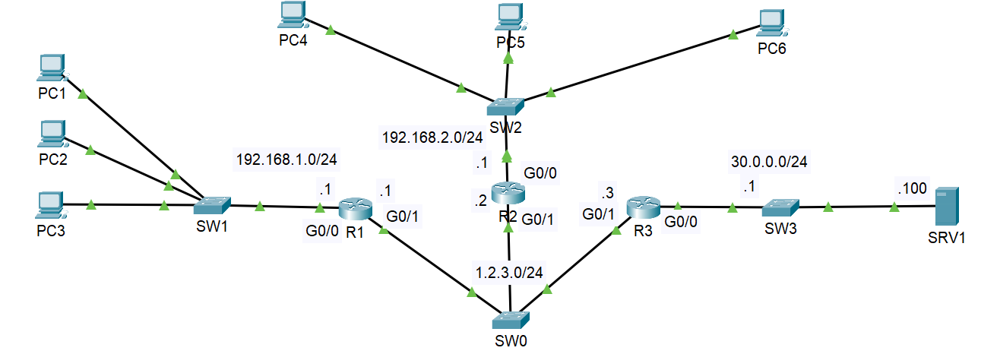

# Network Troubleshooting Lab (RIP, DHCP, NAT, DNS, SSH)

## 📌 Overview

This project demonstrates troubleshooting of multiple real-world network issues across routing, DHCP, NAT, DNS, and remote access.

The lab simulates a multi-router environment where several misconfigurations were intentionally introduced and resolved step-by-step.

---

## 🧠 Objectives

* Identify and fix routing issues (RIP)
* Resolve DHCP failures using relay (ip helper)
* Troubleshoot NAT/PAT misconfiguration
* Fix missing DNS configuration in DHCP
* Enable secure remote access via SSH

---

## 🏢 Network Design

* Multiple routers connected via a shared network
* LAN segments:

  * 192.168.1.0/24
  * 192.168.2.0/24
* External network for NAT testing
* DHCP and DNS services configured

---

## 🧪 Technologies Used

* RIP Routing
* DHCP (with relay)
* NAT/PAT
* DNS configuration
* SSH (remote access)

---

## 🖼️ Topology

---

## 📂 Project Files

* issues-and-fixes.md → Detailed troubleshooting steps
* configuration.md → Key configurations
* verification.md → Testing and validation

