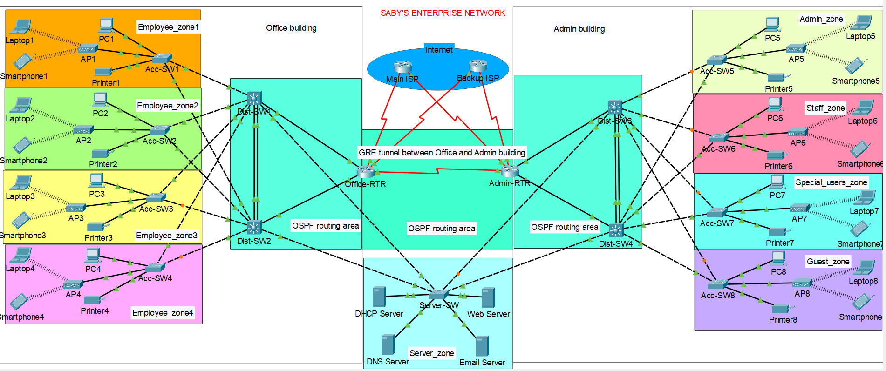

# 🌐 Saby's Enterprise Network Lab

## 📌 Overview

This project focuses on designing and implementing a **highly available and redundant multi-site enterprise network** using Cisco Packet Tracer. The topology simulates real-world enterprise requirements where **zero downtime, failover, and resilience** are the primary goals.

---

## 🏗️ Architecture

### 🔹 Sites

* Office Building
* Admin Building

### 🔹 Layers

* Access Layer (End devices, APs)
* Distribution Layer (Redundant L3 switches)
* Core/WAN Layer (Redundant routers + ISP connectivity)

---

## 🔁 High Availability & Redundancy (CORE FOCUS)

This network is designed with redundancy at every critical layer:

### 🟢 Gateway Redundancy

* **HSRP (Hot Standby Router Protocol)** deployed across all VLANs
* Virtual IP used as default gateway
* Automatic failover between Distribution switches

### 🟢 Link Redundancy

* **EtherChannel** used between switches:

  * LACP (Office)
  * PAgP (Admin)
* Prevents STP blocking issues and ensures load balancing

### 🟢 Device Redundancy

* Dual Distribution switches per site
* Redundant uplinks to core routers

### 🟢 WAN Redundancy

* Dual ISP connections
* **Floating static routes** for automatic failover

### 🟢 Path Redundancy

* Multiple routing paths via OSPF
* **GRE Tunnel** provides alternate logical path between sites

---

## 🌐 WAN & Routing

* **OSPF** for dynamic routing and fast convergence
* **GRE Tunnel** for resilient inter-site communication
* Automatic failover using primary + backup ISP

---

## 🧩 VLAN Segmentation

### Office Building

* VLAN 10 – Employee Zone 1
* VLAN 20 – Employee Zone 2
* VLAN 30 – Employee Zone 3
* VLAN 40 – Employee Zone 4

### Admin Building

* VLAN 50 – Admin
* VLAN 80 – Staff
* VLAN 100 – Special Users
* VLAN 110 – Guest

### Server VLAN

* VLAN 70 – Centralized Services

---

## 🖥️ Server Infrastructure (Centralized & Redundant Access)

| Service      | IP Address     |
| ------------ | -------------- |
| DHCP Server  | 192.168.102.66 |
| DNS Server   | 192.168.102.67 |
| Email Server | 192.168.102.68 |
| Web Server   | 192.168.102.69 |

* Servers are accessible from both sites
* Redundant paths ensure uninterrupted service availability

---

## ⚙️ Services Configuration

### 🔹 DHCP

* Centralized DHCP server
* VLAN-based scopes
* **DHCP relay (ip helper-address)** ensures cross-site IP assignment

### 🔹 DNS

* Domain: `sabycompany.com`
* Resolves internal services reliably across sites

### 🔹 Web Server

* HTTP service enabled
* Accessible via domain name across network

### 🔹 Email Server

* Internal mail system with multiple users
* Verified end-to-end communication

---

## 📡 Wireless Setup

* Autonomous APs in each zone
* VLAN-based segmentation
* WPA2 security

---

## 🔐 NAT & Internet Resilience

* PAT (Overload) configured
* Dual ISP ensures continuous internet access
* Automatic failover tested successfully

---

## 🧪 Testing & Validation

### ✅ Redundancy Tests (Primary Focus)

* HSRP failover validated (gateway switch shutdown)
* ISP failover validated (primary link failure)
* EtherChannel link failure tested (no traffic disruption)

### ✅ Connectivity

* Inter-VLAN routing successful
* Inter-site communication via GRE tunnel

### ✅ Services

* DHCP works across both sites
* DNS resolution successful
* Email communication verified
* Web application accessible via domain

---

## 🧠 Key Learnings

* Designing networks with **redundancy at every layer**
* Importance of **HSRP virtual gateway**
* Handling **asymmetric routing and L2 issues**
* Implementing **failover mechanisms (ISP + gateway + links)**
* Understanding limitations of Packet Tracer and debugging effectively

---

## 🚀 Future Enhancements

* BGP for dynamic ISP routing
* QoS for traffic prioritization
* ACL-based segmentation (Guest isolation)
* Monitoring (SNMP, Syslog)
* STP optimization (root primary/secondary tuning)

---

⭐ If you found this project useful, feel free to star the repo!

## 👨‍💻 Author

**Sabyasachi Dasgupta**

---

## ⭐ Summary

This project demonstrates a **highly resilient enterprise network design**, emphasizing redundancy, failover, and continuous service availability across multiple sites. It reflects real-world network engineering practices aligned with CCNA and CCNP-level concepts.

